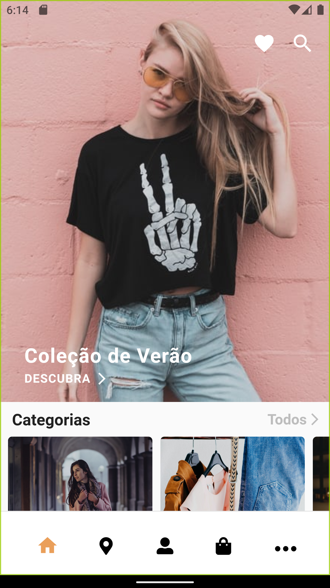
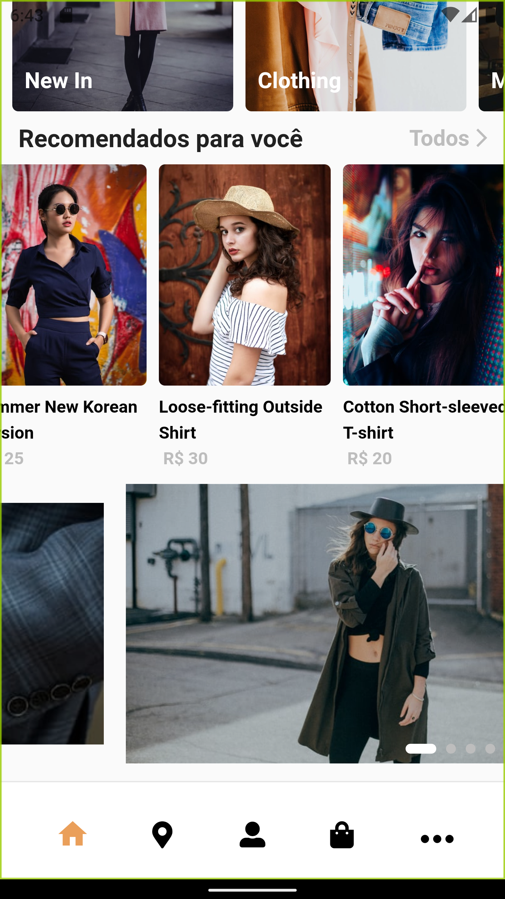
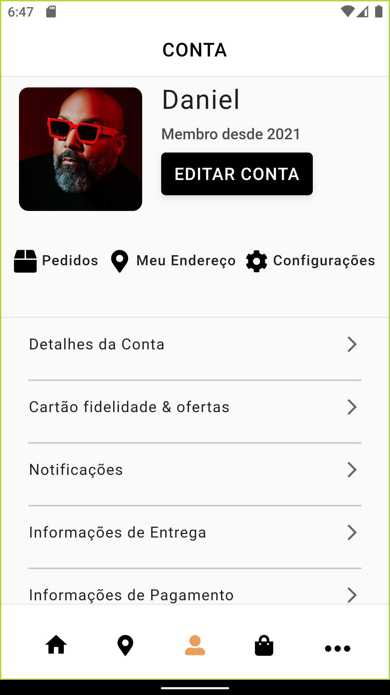
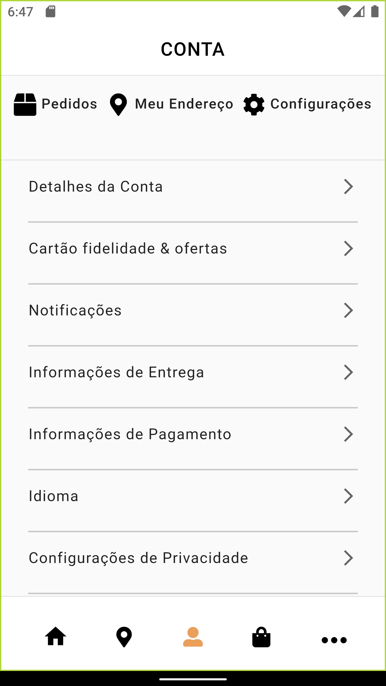

# Entregas em minutos 🙅🏽‍♂️


## About

<p align="center">
Project developed with the objective of starting a business about fast delivery on São Luís.
</p>


## Table of Contents
=================

   * [About](#about)
   * [Table of Contents](#table-of-contents)
   * [Project Description](#-project-description)
   * [Prerequisites](#-prerequisites)
   * [Installation](#-installation)
   * [Technologies](#-technologies)
   * [Author](#-author)

---

## 💻 Project Description

The project consists of a store developed intending solving custumers problems around purchase fashion items like dresses, shirts, pants, among other clothing items. 

The application has an API that is being developed together this project where I'll to make avalieble coming soon 🙃
<!-- The project consists of a grocery store delivery developed intending solving custumers problems around purchase basic items like rice, beans, pasta, etc...

The application has an API that is being developed together this project where I'll to make avalieble coming soon 🙃 -->

### Screenshots:

<table align="center">
  <tr>
    <td>Start Screen</td>
    <td>More about Home</td>
  </tr>
  <tr>
    <td></td>
    <td></td>
  </tr>
  <tr>
    <td>Store screen</td>
    <td>Others screens</td>
  </tr>
  <tr>
    <td></td>
    <td></td>
  </tr>
   <tr>
    <td>Account Screen</td>
    <td>More about Account</td>
  </tr>
    <tr>
    <td></td>
    <td></td>
  </tr>

 </table>

---

<a name="prerequisites"></a>
## ⚙️ Prerequisites

Before starting, you need the Flutter Framework installed and the environment configured. Flutter can be downloaded from [here](https://flutter.dev/).

Since Flutter is installed and configured (test this with the `flutter doctor` command). you can now clone this repository and install the dependencies.

```bash/prompt
# Clone this repository
$ git clone https://github.com/ivictoruan/entregas_15min
# Enter in the project folder in terminal/cmd
$ cd entregas_15min
```

## 🚀 Installation

After installing the Flutter framework and running the fake API server, you can install the dependencies and run the project on a device or simulator/emulator.

```bash
# Install dependencies
$ flutter pub get
# For a better experience, execute this command
# with an opened simulator/emulator or even with
# a deviced plugged
$ flutter run
```

---

## 🛠 Technologies

- [Flutter](https://flutter.dev/)
- [Provider](https://pub.dev/packages/provider)
<!-- - [Dio](https://pub.dev/packages/dio) -->
- [DjangoRestFramework](https://www.django-rest-framework.org/)


---

## 🤷‍♂️🙄 Author

<a 
href="https://www.youtube.com/channel/UCYGTHmRH98FPXdnACHAmTjg">
  <sub>
    <b>
    👀 Visite meu canal no Youtube.
    </b>
  </sub>
</a>

<a href=" https://www.youtube.com/channel/UCYGTHmRH98FPXdnACHAmTjg">
 

Developed with 🥵 by Victor Ruan Diniz Pereira
<br>
Science and Techology student precipitated in Computer Engineering from the Federal University of Maranhão 

[](https://www.linkedin.com/in/ivictoruan/)