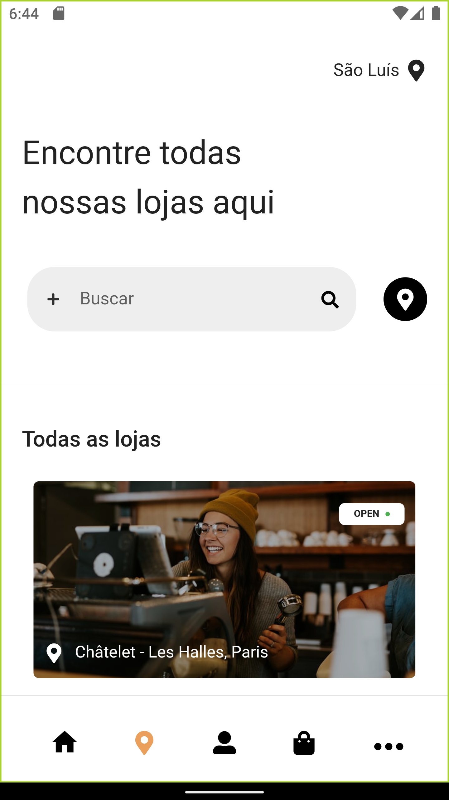

# Entregas em minutos 🙅🏽‍♂️


## About

<!-- <p align="center">
Small educational project developed with the objective of presenting the concepts related to the development of mobile applications using Flutter for the course **Mobile Application Development** (2021.2) of the Computer Engineering Course - Federal University of Maranhão (UFMA)
</p> -->


## Table of Contents
=================

   * [About](#about)
   * [Table of Contents](#table-of-contents)
   * [Project Description](#-project-description)
   * [Prerequisites](#-prerequisites)
   * [Installation](#-installation)
   * [Technologies](#-technologies)
   * [Author](#-author)

---

## 💻 Project Description
<!-- 
The project consists of a simple food delivery developed during the classes of the course in order to help the students to understand how some concepts are implemented in a real world app using the [Flutter framework](https://flutter.dev/). Concepts like design principles, architecture of mobile applications, technologies (native, web, hybrid), lifecycle, UI rendering, componentization, navigation, state management and API access and consumption (as well as Dart and Flutter 😄) were some topics discussed in the course.

The application has some component gaps to be filled by the students (or anyone with this code 😉). The design was based on the [Food delivery app Ui kit](https://www.figma.com/community/file/893381127703378146). -->

### Screenshots:

<table>
  <tr>
    <td>Start screen</td>
    <td>Login screen</td>
  </tr>
  <tr>
    <td></td>
    <td></td>
  </tr>
  <tr>
    <td>Store screen</td>
    <td>Others screens</td>
  </tr>
  <tr>
    <td></td>
    <td></td>
  </tr>
 </table>

---

<a name="prerequisites"></a>
## ⚙️ Prerequisites

Before starting, you need the Flutter Framework installed and the environment configured. Flutter can be downloaded from [here](https://flutter.dev/).

Since Flutter is installed and configured (test this with the `flutter doctor` command). you can now clone this repository and install the dependencies.

```bash/prompt
# Clone this repository
$ git clone https://github.com/ivictoruan/entregas_15min
# Enter in the project folder in terminal/cmd
$ cd entregas_15min
```

<!-- In order to run the app, you also need to start a fake REST API server which will provide the data for the app menu. We suggest to use the `json-server`, Node.js package. In order to install this server, you will need Node.js installed in your system (it can be downloaded [here](https://nodejs.org/en/)). -->

<!-- ```bash
# Install the json-server globally in your system
$ npm install -g json-server
# Run the server using the api.json file available
# in the project. Run it in a separated terminal
$ json-server --watch api.json
``` -->
---

## 🚀 Installation

After installing the Flutter framework and running the fake API server, you can install the dependencies and run the project on a device or simulator/emulator.

```bash
# Install dependencies
$ flutter pub get
# For a better experience, execute this command
# with an opened simulator/emulator or even with
# a deviced plugged
$ flutter run
# By default, the application access the API in the
# address http://localhost:3000/dishes and the
# default email/password are email@email.com /
# 123456. To change this, you can define those params
# using the following optional parameters
$ flutter run --dart-define=endpointDishes=SOME_VALUE1 \
   --dart-define=defaultEmail=SOME_VALUE2 \
   --dart-define=defaultPassword=SOME_VALUE3
```

---

## 🛠 Technologies

- [Flutter](https://flutter.dev/)
- [Provider](https://pub.dev/packages/provider)
- [Dio](https://pub.dev/packages/dio)
- [DjangoRestFramework](https://www.django-rest-framework.org/)


---

## 🤷‍♂️🙄 Author

<a 
href="https://github.com/ivictoruan">
  <sub>
    <b>
    👀 Visite meu canal no Youtube.
    </b>
  </sub>
</a>

<a href=" https://www.youtube.com/channel/UCYGTHmRH98FPXdnACHAmTjg">
 
 <br />
 <sub><b>Acesse aqui.</b></sub></a>

Developed with 🥵 by Victor Ruan Diniz Pereira

[](https://www.linkedin.com/in/ivictoruan/)